# DevOps指南

<!-- TOC -->
* [DevOps指南](#devops)
  * [1. 准备工作](#1-)
    * [1.1 云服务器配置](#11-)
    * [1.2 连接服务器实例](#12-)
    * [1.3 配置云服务网关](#13-)
    * [1.4 Linux必备命令](#14-linux)
  * [2. 安装必备工具](#2-)
    * [2.1 必备工具 - jdk，node，go](#21----jdknodego)
    * [2.2 必备工具 - docker，docker-compose](#22----dockerdocker-compose)
    * [2.3 必备工具 - Jenkins](#23----jenkins)
    * [2.4 必备工具 - golangci-lint](#24----golangci-lint)
  * [3. 配置Jenkins](#3-jenkins)
    * [3.1 初始化Jenkins](#31-jenkins)
    * [3.2 安装重要插件](#32-)
    * [3.3 挂载jdk](#33-jdk)
    * [3.4 挂载nodejs](#34-nodejs)
    * [3.4 挂载go](#34-go)
    * [3.6 连接代码仓库](#36-)
  * [4. 多分支流水线Pipeline](#4-pipeline)
    * [4.1 创建多分支流水线](#41-)
    * [4.2 运行多分支流水线](#42-)
  * [5. 安装流水线工具](#5-)
    * [5.1 静态代码分析 - SonarQube](#51----sonarqube)
      * [5.1.1 启动SonarQube](#511-sonarqube)
      * [5.1.2 安装sonar-scanner - 直接注入方式（插件方式见5.1.3，插件方式为主）](#512-sonar-scanner---513)
      * [5.1.3 安装sonar-scanner - 插件方式（推荐）](#513-sonar-scanner---)
    * [5.2 安全漏洞扫描（待补充）](#52-)
    * [5.3 镜像仓库 - Harbor](#53----harbor)
    * [5.4 通过harbor存储的镜像生成容器](#54-harbor)
  * [6. 检查当前root目录](#6-root)
  * [7. PR触发CI](#7-prci)
    * [7.1 安装插件](#71-)
    * [7.2 配置JOB](#72-job)
    * [7.3 配置webhook](#73-webhook)
    * [7.4 配置repo添加rule](#74-reporule)
    * [7.5 添加jenkins检查](#75-jenkins)
  * [8. 安装数据库 - MySQL](#8----mysql)
  * [9. 安装内存数据库 - Redis](#9----redis)
  * [10. 域名](#10-)
    * [10.1 购买域名](#101-)
    * [10.2 备案](#102-)
    * [10.3 解析域名](#103-)
    * [10.4 SSL证书](#104-ssl)
  * [11. 安装网关 - Nginx](#11----nginx)
  * [12. 安装Vault - Hashicorp Vault](#12-vault---hashicorp-vault)
    * [12.1 部署](#121-)
    * [12.2 配置](#122-)
  * [13. 安装ETCD - quay.io/coreos/etcd](#13-etcd---quayiocoreosetcd)
<!-- TOC -->

## 1. 准备工作

### 1.1 云服务器配置
+ 型号：阿里云ECS
+ CPU：2核(必须)
+ 内存：8G(必须)
+ 硬盘：50G
+ 操作系统：CentOS7.9

### 1.2 连接服务器实例
工具：MobaXterm

1. 在云控制台生成密钥对
2. 将下载的私钥链入mobaxterm的session的SSH中
3. 在阿里云设置登录密码
4. 设置credentials用户名和密码
5. 登录服务器
```shell
# 更新yum
sudo yum update
# 如果是Debian或者Ubuntu
sudo apt update
sudo apt upgrade
```

### 1.3 配置云服务网关

如图手动添加，开放所有端口，后面可以自行调整。

### 1.4 Linux必备命令
```shell
# 释放缓存
sync && echo 3 > /proc/sys/vm/drop_caches
sysctl -w vm.drop_caches=3
echo 1 > /proc/sys/vm/drop_caches
# 清除停掉的容器和镜像
docker container prune -f
docker image prune -f
# 重启docker，清理内存
sudo systemctl restart docker
# 从外部查看容器内部环境变量（无法进入容器时）
docker inspect --format '{{range .Config.Env}}{{println .}}{{end}}' go-maxms_main
```


## 2. 安装必备工具

### 2.1 必备工具 - jdk，node，go
```shell
# 安装包位置
cd ~
mkdir pkg
cd pkg

# 解压安装包
# jdk8u333
tar -zxvf jdk-8u333-linux-aarch64.tar.gz -C /root/tools
# node-v16
tar xf node-v16.17.0-linux-x64.tar.xz -C /root/tools
# go1.21
tar -zxvf go1.21.5.linux-amd64.tar.gz -C /root/tools

# 修改文件名 （go不用改）
cd /root/tools
mv jdk1.8.0_333 jdk
mv node-v16.17.0-linux-x64 node

# 修改环境变量
sudo vi /etc/profile
# 找到export，在PATH变量上面一行加入
export NODE_HOME=/root/tools/node
export GO_HOME=/root/tools/go
# 整合PATH行
export PATH=$PATH:$NODE_HOME/bin:$GO_HOME/bin
# 载入环境变量
source /etc/profile
```

### 2.2 必备工具 - docker，docker-compose
```shell
# docker
# 下载安装 要等好久
curl -fsSL https://get.docker.com | bash -s docker --mirror Aliyun
# 启动 重启用restart
sudo systemctl start docker
# 开机启动
sudo systemctl enable docker
# 检查安装结果
docker --version

# docker-compose
# 下载安装
sudo curl -L https://github.com/docker/compose/releases/download/1.23.2/docker-compose-`uname -s`-`uname -m` -o /usr/bin/docker-compose
# 增加执行权限
sudo chmod +x /usr/bin/docker-compose
# 检查安装结果
docker-compose --version
```

### 2.3 必备工具 - Jenkins
```shell
# Jenkins
# 拉取镜像（所用版本为下面）
sudo docker pull jenkins/jenkins
sudo docker pull jenkins/jenkins:2.401.3-lts
# 创建docker-compose.yaml路径
cd
mkdir docker
cd docker
mkdir jenkins_docker
cd jenkins_docker
# 拷贝配置好的docker-compose.yaml（配置见下面yaml）
# 启动Jenkins
cd /root/docker/jenkins_docker
docker-compose up -d
# 赋予宿主机jenkins data目录权限
sudo chmod -R 777 data
# 重启Jenkins容器
docker-compose restart
# 将node挂载入jenkins容器
cd /root/tools
cp -r node /root/docker/jenkins_docker/data
# 将go挂载入jenkins容器
cd /root/tools
cp -r go /root/docker/jenkins_docker/data
```
```shell
# 添加daemon.json，为了后面Harbor登录追加仓库地址信息
sudo vi /etc/docker/daemon.json
```
daemon.json
```json
{
  "insecure-registries": ["172.16.96.97:9002"]
}
```
```shell
# 重启docker
sudo systemctl daemon-reload
sudo systemctl restart docker
```

### 2.4 必备工具 - golangci-lint
```shell
# golangci-lint
curl -sSfL https://raw.githubusercontent.com/golangci/golangci-lint/master/install.sh | sh -s -- -b /root/tools/go/bin v1.55.2
```
> 如果无法下载，进入官网，把编译的可执行文件拷贝到对应目录
```shell
# 解压安装包
tar -zxvf golangci-lint-1.55.2-linux-amd64.tar.gz -C /root/tools
# 修改文件名
cd /root/tools
mv golangci-lint-1.55.2-linux-amd64 golangci-lint
# 复制到go/bin目录
cp golangci-lint/golangci-lint go/bin
# 检查安装是否成功
golangci-lint -v
```


## 3. 配置Jenkins

### 3.1 初始化Jenkins
```shell
# 查看jenkins日志
sudo docker logs -f jenkins
```
找到日志里的密码，浏览器中访问jenkins，输入密码。<br/>
密码在`Please use the following password to proceed to installation:`后面。两坨星星中间夹着。

选择手动安装插件（右边按钮）。默认选项即可，直接点击安装。<br/>
如果失败，进入面板后找到`Mange Jenkins`→`Manage Plugins`→`Available`，手动安装<br/>
如果总是不成功，就更改为国内的插件源。

设置用户名密码。根据提示操作，直到进入到Welcome界面。

### 3.2 安装重要插件
`Manage Jenkins` → `Manage Plugins` → `Available` →

`Search` `Git Parameter` → 勾选 →

`Search` `Publish Over SSH` → 勾选 →

`Search` `NodeJS` → 勾选 →

`Search` `Go` → 勾选 →

点击`Install without restart`

### 3.3 挂载jdk
```shell
cp -rTf /root/tools/jdk /root/docker/jenkins_docker/data
```
回到浏览器jenkins的`Dashboard` → `Global Tool Configuration` → `JDK` → `Add JDK`，取消自动安装，按下图填写。


### 3.4 挂载nodejs
> 可尝试先删除/root/docker/jenkins_docker/data下的对应文件夹
```shell
cp -rf /root/tools/node /root/docker/jenkins_docker/data
```
回到浏览器jenkins的`Dashboard` → `Global Tool Configuration` → `NodeJS` → `Add NodeJS`，取消自动安装，按下图填写。


### 3.4 挂载go
> 可尝试先删除/root/docker/jenkins_docker/data下的对应文件夹
```shell
cp -rf /root/tools/go /root/docker/jenkins_docker/data
```
回到浏览器jenkins的`Dashboard` → `Global Tool Configuration` → `Go` → `Add Go`，取消自动安装，按下图填写。

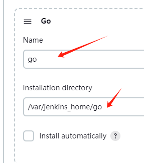

### 3.6 连接代码仓库
`Dashboard` → `Configure System`，找到`Publish over SSH`，点击`Add`


这个username是远程服务器的username，密码和私钥也是连接那个服务器用的。

`Test Configuration`测试是否跑通。如果提示路径问题，注意mkdir。显示SUCCESS则保存。

> Remote Directory 此目录必须存在，不会被创建。


## 4. 多分支流水线Pipeline

### 4.1 创建多分支流水线
`New Item` → 输入名称 → `Multibranch Pipeline` → OK

找到`Branch Sources` → `Add source` → `Git`


在`Branch Sources`下加入这3个


找到`Build Configuration` → 设置Jenkinsfile的路径，注意：这是repo里的路径和文件名


保存后，进行scan，测试repo中的Jenkinsfile

> 如果需要忽略一些repo的分支，可以增加filter

如果选择每个JOB有不同的保留个数，可以在config里选择`discard a build`，然后生成`buildDiscard`的语法。
并粘贴进pipeline，与environment并列。

为所有Job设置结束后保留N条流水线运行记录

`Dashboard` → `Configure System`，找到`Global Build Discarders`，点击`Add`


### 4.2 运行多分支流水线

确保repo：
+ 项目名称正确
+ 有Jenkinsfile
+ 有.golangci.yml
+ 有vendor
+ 有sonar-project.properties
+ 有deploy.sh

> 根据console信息修改代码

> CI与CD的区别是流水线Config Selection步骤，需要用户进入console点击最后一行进行选择，CI使用默认选项，默认1分钟选择时间

如果checkout出现错误，报github.com timeout、refused、couldn't connect
```shell
# linux 进入jenkins容器，绕过DNS
docker exec -it jenkins sh
echo " 140.82.113.3  github.com" >> /etc/hosts

# windows 查询设置-网络-代理-手动设置代理，地址填127.0.0.1，端口填33210（随意，但保持一致），然后如下配置git
git config --global http.proxy http://127.0.0.1:33210/
git config --global https.proxy https://127.0.0.1:33210/
# 不起作用，可清除代理
git config --global --unset http.proxy
git config --global --unset https.proxy
```


## 5. 安装流水线工具

### 5.1 静态代码分析 - SonarQube

#### 5.1.1 启动SonarQube

版本10.3
```shell
# 拉取镜像
docker pull postgres
docker pull sonarqube:10.3.0-community
# 创建docker-compose.yaml并运行
cd /root/docker
mkdir sonarqube_docker
cd sonarqube_docker
# 粘贴入此路径，然后执行命令
docker-compose up -d
# 查看日志
docker logs -f sonarqube
# 有两个ERROR，扩增虚拟内存
sudo vi /etc/sysctl.conf
# 在注释后面增加如下，并保存
vm.max_map_count=262144
# 执行生效
sudo sysctl -p
# 重启容器
docker-compose up -d
# 查看日志，还有错也没办法
docker logs -f sonarqube
```

在浏览器输入ip和预设端口号，sonarqube初始账户和密码都是`admin`

按提示操作，到能看到面板为止。

#### 5.1.2 安装sonar-scanner - 直接注入方式（插件方式见5.1.3，插件方式为主）

下载 `sonar-scanner-cli-5.0.1.3006-linux.zip`
> https://binaries.sonarsource.com/?prefix=Distribution/sonar-scanner-cli/

```shell
# 安装解压zip工具
sudo yum -y install unzip
# 解压
cd /root/pkg
unzip sonar-scanner-cli-5.0.1.3006-linux.zip
cp -r sonar-scanner-5.0.1.3006-linux/ sonar-scanner
# 移动sonar-scanner到jenkins挂载卷目录
mv /root/pkg/sonar-scanner /root/docker/jenkins_docker/data
# 配置sonar-scanner
vi /root/docker/jenkins_docker/data/sonar-scanner/conf/sonar-project.properties
```
+ 撤销注释并修改 `sonar.host.url=http://宿主机内网ip:9001`<br/>
+ 撤销UTF-8注释


给sonar-scanner设置token，来到浏览器sonar面板右上角


> 确保项目根目录下有sonar-project.properties文件，切token等属性已设置

```shell
# 使用扫描命令
# 运行一次流水线就会产生workspace文件夹
cd /root/docker/jenkins_docker/data/workspace/go-maxms_main
# go
/root/docker/jenkins_docker/data/sonar-scanner/bin/sonar-scanner \
    -Dsonar.sources=. \
    -Dsonar.projectname=${JOB_NAME} \
    -Dsonar.login=squ_d106b36ec221b6b317880e261792e131a6e3200a \
    -Dsonar.projectKey=go-maxms_main \
    -Dsonar.nodejs.executable=/usr/bin/go \
    -Dsonar.inclusions=src/**/*.go \
    -Dsonar.coverage.exclusions=internal/**/*,environment/**/*,spec/**/*,src/pb/**/*,script/**/* \
    -Dsonar.qualitygate.wait=true
# nodejs
/root/docker/jenkins_docker/data/sonar-scanner/bin/sonar-scanner \
    -Dsonar.sources=. \
    -Dsonar.projectname=${JOB_NAME} \
    -Dsonar.login=squ_d106b36ec221b6b317880e261792e131a6e3200a \
    -Dsonar.projectKey=${JOB_NAME} \
    -Dsonar.nodejs.executable=/usr/bin/node \
    -Dsonar.inclusions=src/**/*.js,src/**/*.jsx \
    -Dsonar.coverage.exclusions=node_modules/**/*,server/build/**/*,config/**/*,scripts/**/*,public/**/*,src/config/**/* \
    -Dsonar.qualitygate.wait=true
```

成功会看到：


#### 5.1.3 安装sonar-scanner - 插件方式（推荐）

jenkins安装SonarQube Scanner插件

配置插件：
`Dashboard` → `Configure System`，找到`SonarQube servers`，点击`Add`，注意添加token


`Dashboard` → `Tools`，找到`SonarQube Scanner installations`，点击`Add SonarQube Scanner`


```shell
# 配置sonar-scanner
vi /root/docker/jenkins_docker/data/tools/hudson.plugins.sonar.SonarRunnerInstallation/sonar-scanner/conf/sonar-project.properties
```

+ 撤销注释并修改 `sonar.host.url=http://宿主机内网ip:9001`<br/>
+ 撤销UTF-8注释


给sonar-scanner设置token，来到浏览器sonar面板右上角


> 确保项目根目录下有sonar-project.properties文件，切token等属性已设置

### 5.2 安全漏洞扫描（待补充）
checkmarx, Tenable.io CS, Harness

### 5.3 镜像仓库 - Harbor
版本2.10.0
```shell
# 安装Harbor
tar -zxvf /root/pkg/harbor-offline-installer-v2.10.0.tgz -C /root/tools
# 配置harbor
cp /root/tools/harbor/harbor.yml.tmpl /root/tools/harbor/harbor.yml
vi /root/tools/harbor/harbor.yml
```


初始帐号密码是：admin Harbor12345
```shell
# 创建harbor容器
sudo /root/tools/harbor/install.sh
```

创建一个新项目 - 图中Project Name就是github项目名，不带branch


在Jenkinsfile定义变量
```
environment {
    harborUsername = "admin"
    harborPassword = "Harbor12345"
    harborAddress = "172.16.96.97:9002"
    harborRepo = "repo"
}
```

在pipeline的stage里加入
```shell
docker login -u ${harborUsername} -p ${harborPassword} ${harborAddress}
docker tag ${JOB_NAME}:${TAG} ${harborAddress}/${harborRepo}/${JOB_NAME}:${TAG}
docker push ${harborAddress}/${harborRepo}/${JOB_NAME}:${TAG}
```

如果出现报错：

`Error response from daemon: Get "https://xx.xx.xx.xx:xxxx/v2/": http: server gave HTTP response to HTTPS client`

+ 检查pipeline的Harbor的address变量是否和daemon.json中的一致
+ 注意daemon.json所在路径是否是/etc/docker
+ 调整后，是否重启daemon，是否重启docker

### 5.4 通过harbor存储的镜像生成容器

如果是在相同IP的服务器上，可直接使用
```shell
chmod +x ./deploy.sh
./deploy.sh $harborAddress $harborRepo $ProjectKey $TAG $Container_port $Host_port
```

如果需要在指定服务器建立容器，需使用`ssh publisher`

编写deploy.sh放入宿主机/usr/bin，直接通过deploy.sh xxx运行
```shell
sudo chmod +x deploy.sh
```

使用pipeline代码生成，选择`ssh publisher`，输入要执行的shell代码，生成并复制到pipeline

```shell
sshPublisher(publishers: [sshPublisherDesc(configName: "test", transfers: [sshTransfer(cleanRemote: false, excludes: "", execCommand: "deploy.sh $harborAddress $harborRepo $JOB_NAME $TAG $Container_port $Host_port", execTimeout: 120000, flatten: false, makeEmptyDirs: false, noDefaultExcludes: false, patternSeparator: "[, ]+", remoteDirectory: "", remoteDirectorySDF: false, removePrefix: "", sourceFiles: "")], usePromotionTimestamp: false, useWorkspaceInPromotion: false, verbose: false)])
```

将生成后的shell脚本和上面相同的语句的单引号，改为双引号。

如果出现报错：

`ERROR: Exception when publishing, exception message [Exec exit status not zero. Status [1]]`

+ 检查脚本路径 ./deploy.sh

`ERROR: Exception when publishing, exception message [Exec exit status not zero. Status [127]]`

+ 未找到可执行文件，即工程目录bin/main文件，检查Dockerfile和deploy.sh
+ 在pipeline中，使用`ls -l`查看deploy.sh的权限
+ 注意是`./deploy.sh`，注意使用相对路径，不然有可能会调用/usr/bin下的deploy.sh
+ 注意如果是ssh publisher方法，使用的是系统/usr/bin下的deploy.sh（需要拷贝到此目录）


## 6. 检查当前root目录
```shell
# 下载tree命令
sudo yum install tree
# 只打印前三级目录且不显示隐藏目录和文件
tree -L 3 -I '.*' /root
```
```shell
/root
├── docker # docker-compose.yaml和配置
│         ├── harbor_docker
│         │         └── daemon.json
│         ├── jenkins_docker
│         │         ├── data # jenkins数据
│         │         └── docker-compose.yaml
│         └── sonarqube_docker
│             └── docker-compose.yaml
├── logs # 微服务日志
│         └── go-maxms_main
│             └── golog.txt
├── pkg # 安装包
│         ├── go1.21.5.linux-amd64.tar.gz
│         ├── golangci-lint-1.55.2-linux-amd64.tar.gz
│         ├── harbor-offline-installer-v2.10.0.tgz
│         ├── jdk-8u333-linux-aarch64.tar.gz
│         ├── node-v16.17.0-linux-x64.tar.xz
│         └── sonar-scanner-cli-5.0.1.3006-linux.zip
├── test
├── tools # sdk
│         ├── go
│         ├── golangci-lint
│         ├── harbor
│         └── node
└── www # 静态资源
```


## 7. PR触发CI

### 7.1 安装插件
`GitHub Pull Request Builder`

### 7.2 配置JOB
`Dashboard` → `"User"` → `Configuration` → 找到`API Token` → 点击`Add new Token`，生成并复制

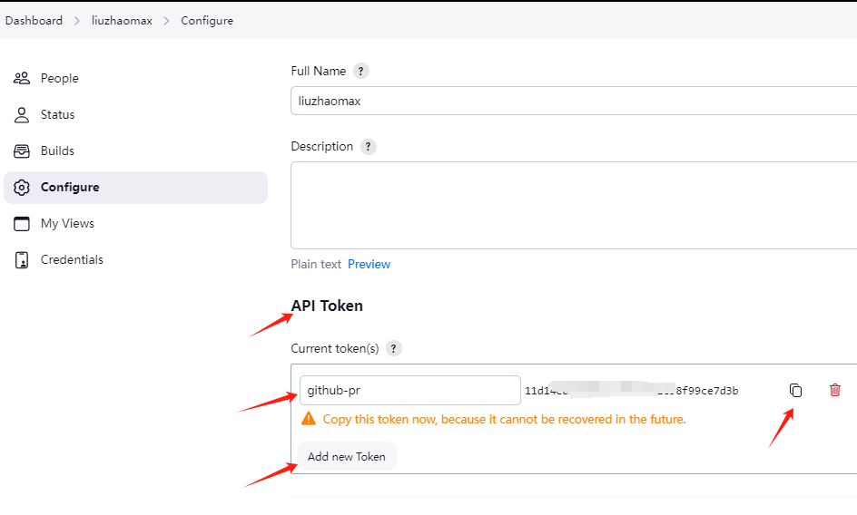

`Dashboard` → `Configure System`，找到`GitHub Pull Request Builder`

将生成的token，粘贴到`Shared secret`，并按下图填写，图中的credential是github access token，在github中生成

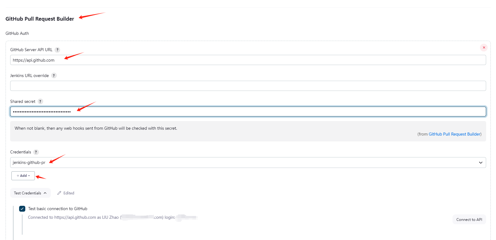

测试是否连通

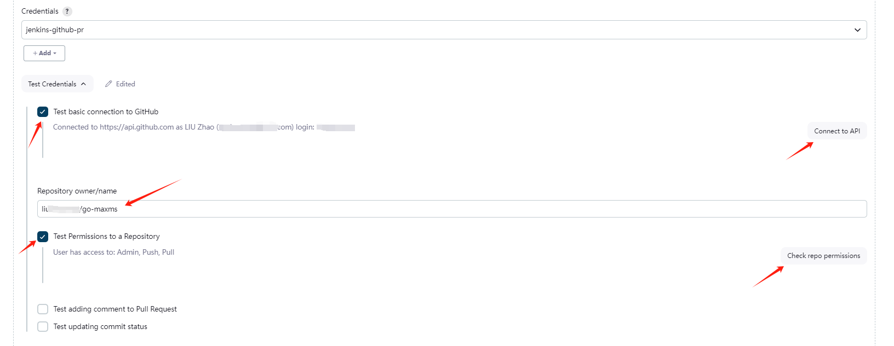

### 7.3 配置webhook
找到需要加入jenkins验证的repo → `Settings` → `Webhooks` → `Add Webhook`，如图填写

secret，即jenkins API token，即shared secret

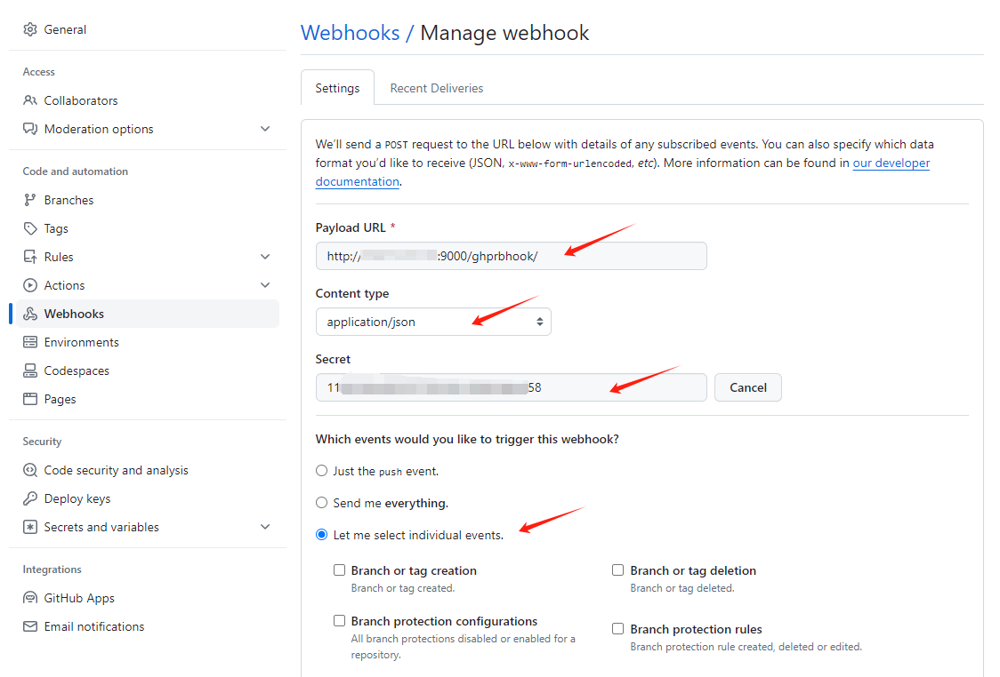

选择图中的 `individual events` → 选上`pull request`

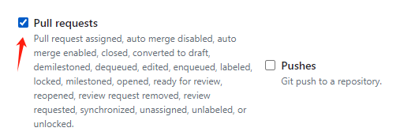

成功后显示`√`，见下图
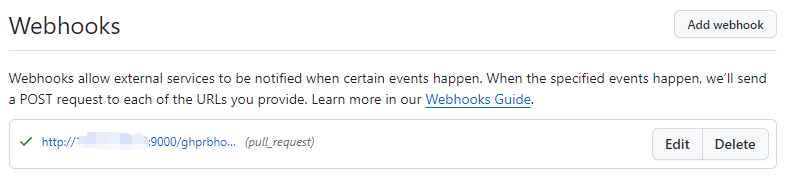

如果报错403
+ 检查secret是否一致
+ 检查hook地址，ip和路径
+ 检查最后是否以`/`结尾

### 7.4 配置repo添加rule
`Github`某repo → `Settings` → `Branches` → `Add Rule` 如图填写

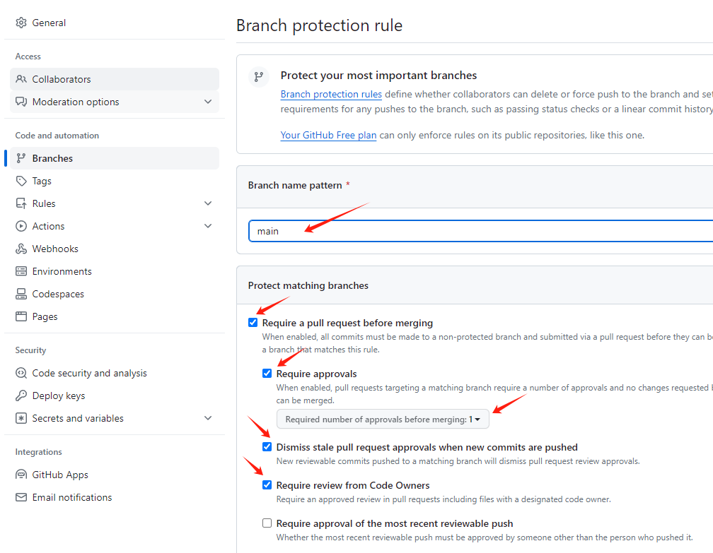

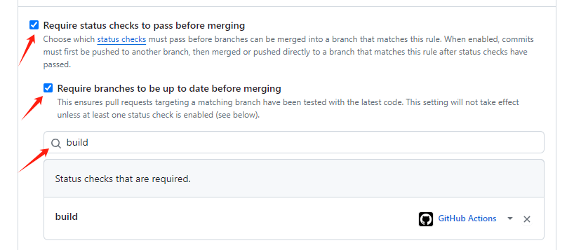

在repo的`Settings` → `General`中，配置PR通用规则，只允许 squash merging，merge后自动删除branch

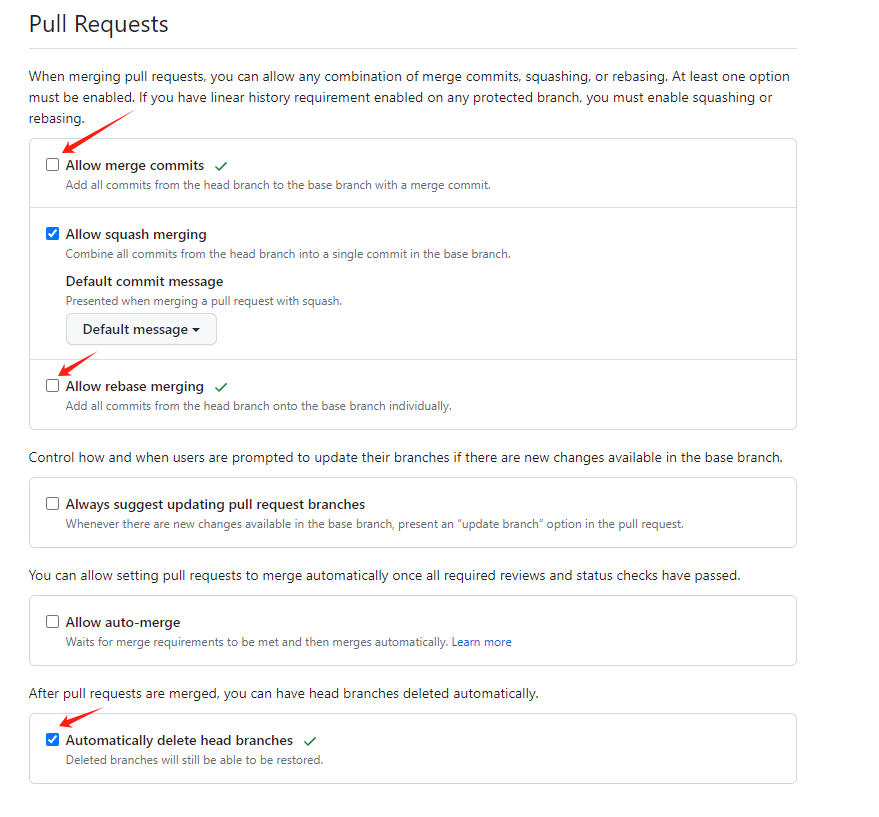

如果没有搜索框，请到repo中添加workflow

> 只有status check通过，且至少有1个review，且code owner必须review，才能merge

### 7.5 添加jenkins检查
使用插件`GitHub App` 将jenkins加入到PR status check中

> https://www.youtube.com/watch?v=aDmeeVDrp0o&t=1100s

进入Github用户`Settings` → `Developer settings` → `GitHub Apps` → `New GitHub App`

按上面链接填写
+ Home URL (Jenkins地址)
+ Webhook URL
+ Repository Permission
  + Administration: Read-only
  + Checks: Read & Write
  + Contents: Read-only
  + Metadata: Read-only
  + Pull requests: Read-only
  + Commit status: Read & Write
  + Webhook: 如果需要jenkins controller管理webhook，则Read & Write，不需要就no access
+ Subscribe to events
  + Check run
  + Check suite
  + Pull request
  + Push
  + Repository
+ 其他默认

提交后，下拉找到`Private keys` → `Generate a private key`

下载后转化pem 
```shell
openssl pkcs8 -topk8 -inform PEM -outform PEM \
  -in jenkins-go-maxms.2024-01-13.private-key.pem \
  -out converted-github-app.pem -nocrypt
```

将创建的Github App安装到账户中，如下图

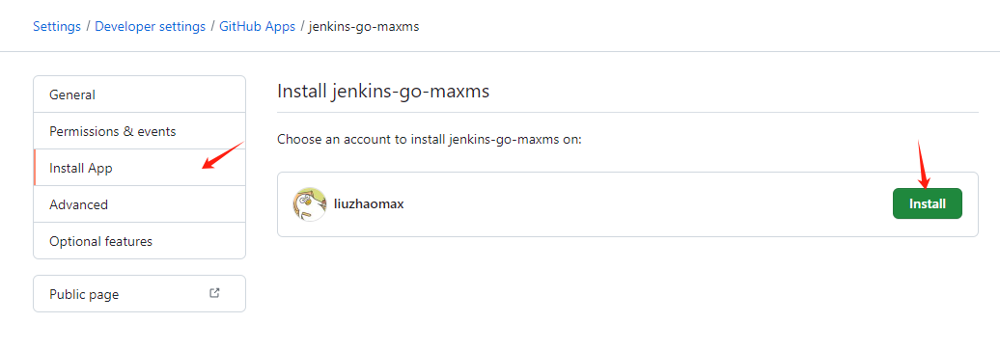

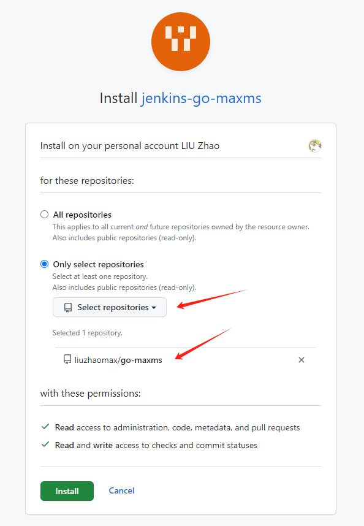

来到Jenkins

`Dashboard` → `Manage Jenkins` → `Credentials` → `System` → `Global credentials (unrestricted)` → `Add Credential`

按图填写，注意名称保持一致

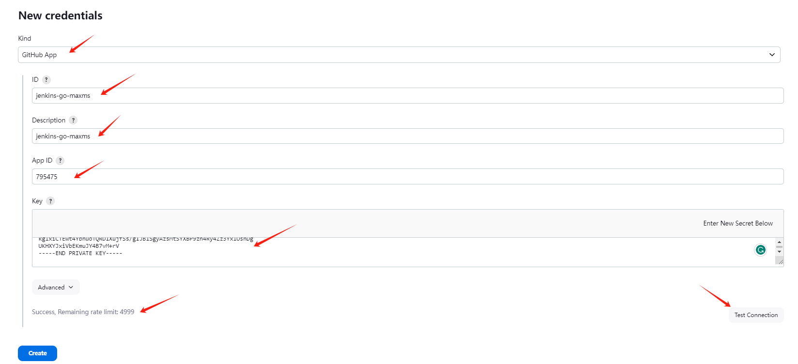

App ID 是下图这个ID，Key是转化后的pem

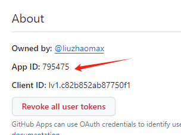

测试成功即可

来到 Multibranch Job 的 config，为 Multibranch Job 添加 Credential

注意：这里删除了Git source，使用了Github source

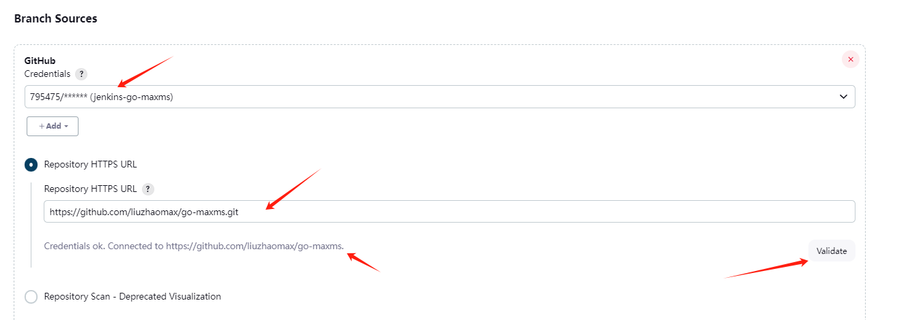

如果有需要，在repo的settings的branch中添加这个APP为required

成功后显示


## 8. 安装数据库 - MySQL

版本8.2.0

```shell
cd /root/docker
mkdir mysql
# 拷贝docker-compose.yaml
cd mysql
docker-compose up -d
```

```shell
# 建立数据库
docker exec -it mysql_master sh
mysql -u root -p
show databases;
create database go_maxms;
show databases;
# 如果遇到权限问题
grant all privileges on go_maxms.* to root;
flush privileges;
```


## 9. 安装内存数据库 - Redis

版本7.2.4

```shell
cd /root/docker
mkdir redis
# 拷贝docker-compose.yaml
cd /root
mkdir redis
cd /root/redis
mkdir redis-conf
# 拷贝redis.conf
# 确保权限 避免Can't open the log file: Permission denied
sudo chown -R root:root /root/redis/redis-data
sudo chown -R root:root /root/redis/redis-logs
sudo chmod 777 /root/redis/redis-data
sudo chmod 777 /root/redis/redis-logs
# 启动
cd /root/docker/redis
docker-compose up -d
```


## 10. 域名

### 10.1 购买域名
> https://wanwang.aliyun.com/

### 10.2 备案
域名指向国内服务器，不备案域名不能访问
> https://beian.aliyun.com/

### 10.3 解析域名

`域名控制台` → 找到要解析的域名 → `管理` → 实名认证

`域名控制台` → 找到要解析的域名 → `解析` → `添加记录` → `生效检测`

> 记录值为IP地址

如果需要子域名转发到特定端口，如下图配置：


### 10.4 SSL证书
> https://www.aliyun.com/product/cas

点击`选购证书` → 找到`免费证书` → `立即购买`


在返回页面 → 找到`免费证书` → `创建证书`

> 注意：由于是免费证书，不能使用通配符，一个证书对应一个子域名


根据提示，来到`域名控制台`页面 → `添加记录`，如下图


等待签发，成功会有邮件通知，下载证书

> HTTPS 相关配置
> https://help.aliyun.com/zh/ssl-certificate/user-guide/install-ssl-certificates-on-nginx-servers-or-tengine-servers


## 11. 安装网关 - Nginx

版本1.25.3
```shell
# 建立目录
cd docker
mkdir nginx
# 拷贝docker-compose.yaml
# 启动
cd /root/docker/nginx
docker-compose up -d
# conf文件
cd /root/nginx/conf.d
# 拷贝 *.conf
# tls
cd /root/nginx/tls
# 拷贝.pem .key
# 重启nginx
docker restart nginx
```
> https://<域名>  测试验证配置是否成功


## 12. 安装Vault - Hashicorp Vault

版本1.15.4

### 12.1 部署

```shell
# 建立挂载卷
mkdir vault
cd vault
mkdir config
mkdir logs
mkdir data
# 建立TLS目录
cd /root/vault/config
mkdir tls
# 拷贝vault_prod.json和tls文件到目录
# 建立vault docker 目录
cd /root/docker
mkdir vault
# 拷贝docker-compose
cd /root/docker/vault
docker-compose up -d
```

### 12.2 配置

初始化vault
1. 进入UI https://宿主机IP:8200
2. 根据提示操作，选择数字如果选3，则会生成3个unseal的key
3. 下载生成的key和token，妥善保管

添加用户
1. 在菜单`Secrets Engines`中，添加secret，设置好路径，例如：cn/corp/nonprod/depa/go-maxms-template-me/sit/secrets
2. 在菜单`Policies`中，添加权限，例子如下，注意路径，kv是新建的secret类型目录名，后面是在第一步设置的路径
3. 在菜单`Access -> Authentication Method`中，添加用户名密码登录方式，即userpass
4. 在菜单`Access -> Group`中，添加团队，例如：cn/corp/depa/squad_1
5. 在菜单`Access -> Entities`中，添加用户，添加Aliases，aliases是登录用户名，选择用户密码登录
6. 在新建的团队里，添加团队成员，即entities
7. 在新建的团队里，添加权限规则，即policies
8. 给新建的用户加密码
9. 设置vault监听日志
10. 使用postman collection验证读写

Policies例子
```hcl format
path "kv/*" {
  capabilities = ["list"]
}

path "kv/data/pwd" {
  capabilities = ["create", "read", "update", "delete"]
}

path "kv/data/jwt" {
  capabilities = ["create", "read", "update", "delete"]
}

path "kv/data/rsa" {
  capabilities = ["create", "read", "update", "delete"]
}

path "kv/data/app/*" {
  capabilities = ["create", "read", "update", "delete"]
}
```
> 注意：上述policy中，第二个路径`kv/data/dev`如果不加`/data`就无法查看到secret

使用命令添加密码，如果是docker要进入docker
```shell
# 进入vault容器
docker exec -it vault sh
# 如果地址不对
export VAULT_ADDR='https://宿主机IP:8200'
# 如果遇到 permission denied
export VAULT_TOKEN="123456"
# 修改密码
vault write auth/userpass/users/liuzhao password="123456"
```


## 13. 安装ETCD - quay.io/coreos/etcd

版本3.5.5

拷贝etcd目录（不包含数据与日志）到服务器，注意修改ip和端口，运行docker-compose

启动后，进入容器，查看状态

```shell
# 集群情况检查
etcdctl endpoint health --cluster -w table
etcdctl endpoint status --cluster -w table
# 查看集群健康检查情况
etcdctl member list --write-out=table 
# 本节点运行状态
etcdctl endpoint status --write-out=table 
# 本节点健康状况
etcdctl endpoint health --write-out=table 
```

常用命令
```shell
# 数据操作
etcdctl put key value
etcdctl get key 
etcdctl del key 

# 删除成员
etcdctl member add etcd4 --peer-urls=http://192.168.10.100:12380
etcdctl member update b112a60ec305e42a --peer-urls=http://192.168.10.100:22380
etcdctl member remove b112a60ec305e42a

# 查看所有告警
etcdctl alarm list
# 解除所有告警
etcdctl alarm disarm

# 对某个key监听操作，当key1发生改变时，会返回最新值
etcdctl watch name
# 监听key前缀
etcdctl watch name --prefix
# 监听到改变后执行相关操作
etcdctl watch name --  etcdctl get age

# 租约 多key可共用一个租约
# 查看所有租约
etcdctl lease list
# 查看某个租约过期时间
etcdctl lease timetolive --keys 6e1e86f4c6512a32
# 续约
etcdctl lease keep-alive 6e1e86f4c6512a36
# 删除 
etcdctl lease revoke 6e1e86f4c6512a39
# 设置过期时间 期外查询键值为空
etcdctl lease grant 60
etcdctl put --lease=6e1e86f4c6512a29 foo bar
# 绑定租约 租约过期后，所有 key 值都会被删除
etcdctl put --lease=6e1e86f4c6512a3e foo1 bar1
```


## 14. 安装Consul

版本1.15.4

拷贝etcd目录到服务器，删除数据目录，运行docker-compose

启动后，进入容器，查看状态


TODO：
+ 流水线示意图，最后一个格子在Failure的时候变红
+ Harbor定时删除SNAPSHOT的image，PR merge后，自动删除PR的image
+ 增加create package和deploy package，简化CD流水线

