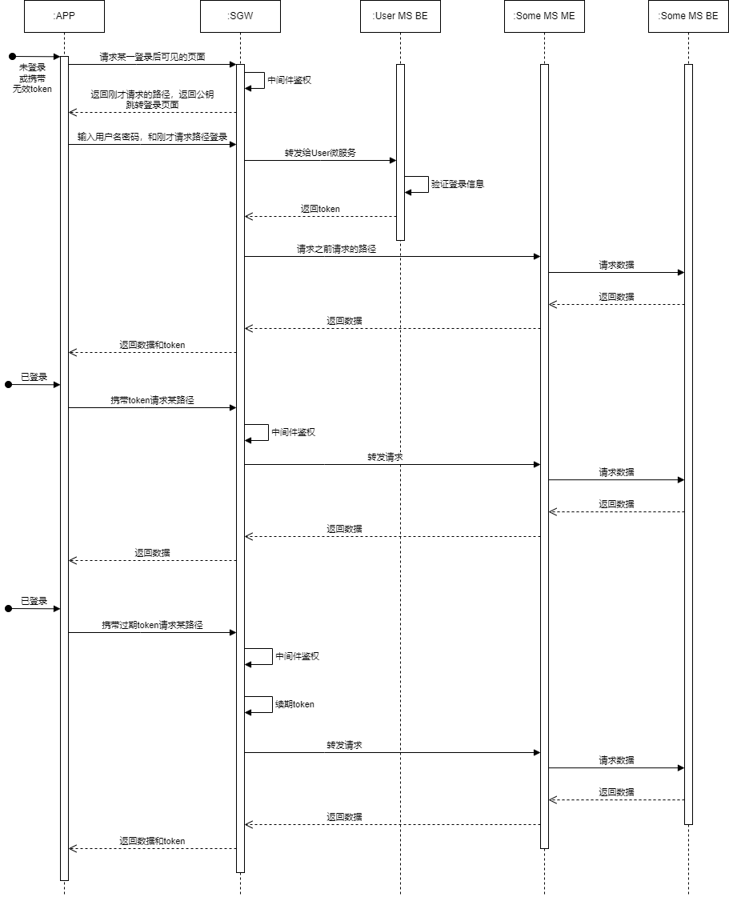

# 计划

## 负载均衡
云 + Nginx

## 网关和鉴权
JWT + RSA + Hashicorp Vault
接口签名 + redis + Hashicorp Vault

鉴权准则：
1. 确保token时效性
2. 确保黑客使用别人的token登录，会因IP不一致无效
3. 确保csrf防御

鉴权判定：
1. 请求IP和token中的IP一致
2. token是否过期

鉴权方式：

用户微服务启动时生成RSA密钥对，并存入vault，如果vault已有密钥对，则获取  
其他微服务启动时从vault获取RSA密钥对  

第一种：

1. 未登录： 
app -> SGW：返回公钥字符串 -> 主页微服务：返回主页公开数据  
2. 开始登录： 

+ 只要鉴权失败，就都跳转登录页面，且返回公钥，且返回之前请求的路径
+ 如果之前没有鉴权，即直接进入登录页面登录，而不是直接进入登录后可见的页面，则失败返回公钥和空路径，跳转登录页面
+ 只要进入登录页面，就返回公钥
3. 已登录： 
app -> SGW：查看Authorisation，鉴权 -> downstream：返回数据  

第二种：

1. 未登录：  
app -> 主页微服务：返回公钥字符串 -> 返回主页公开数据  
2. 开始登录：  
app -> 主页微服务：请求鉴权 -> 用户微服务：鉴权，返回token -> 主页微服务：拼接主页数据与token，并返回 -> app：加载主页  
3. 已登录：  
app -> 主页微服务：鉴权，返回数据  

## 注册中心
ETCD/Consul

## 配置中心
ETCD/Nacos

## 监控中心
Prometheus+Grafana

## 链路追踪
Jaeger

## 日志中心
FileBeat+Logstash+Kibana日志分析，ElasticSearch持久化

## 消息队列
RocketMQ

## 分布式事务
DTM

## 缓存
Redis

## 数据库
MySQL

## 集群
OCP4

## 限流 熔断 降级
resilience4j/Sentinel/查找其他go熔断降级工具 IT老齐

## CI/CD
Jenkins流水线
1. checkout
2. app version
3. lint: golangci-lint
4. build
5. 静态扫描: sonarqube
6. 漏洞扫描: nessus
7. 安全扫描: blackduck
8. build image Harbour
9. git tag
10. package config
11. create package
12. deploy package

## 微服务架构
1. 框架：gin grpc
2. 通信：http rpc
3. 依赖注入：wire
4. 日志：logrus
5. 拦截器：权限RSA+JWT+crypto，跨域
6. 读取配置：viper
